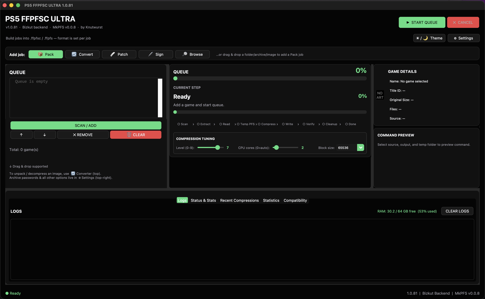
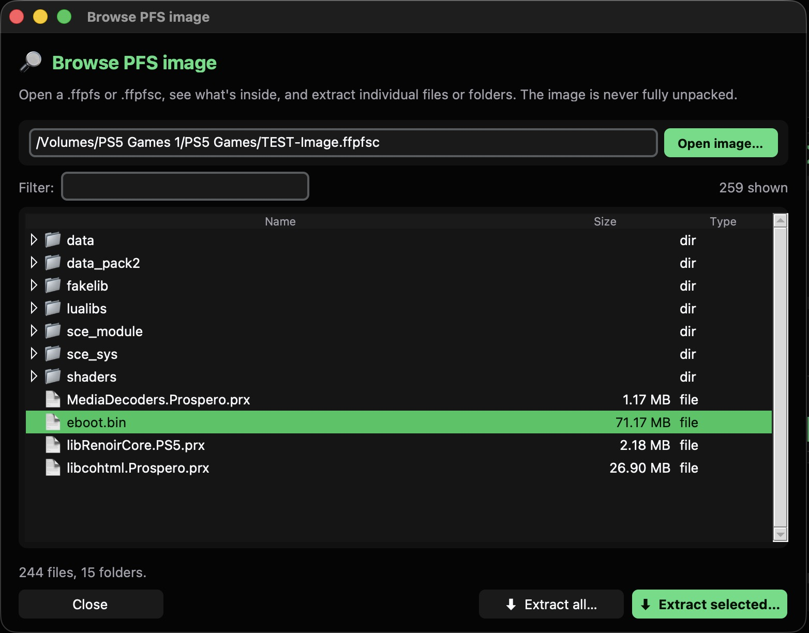
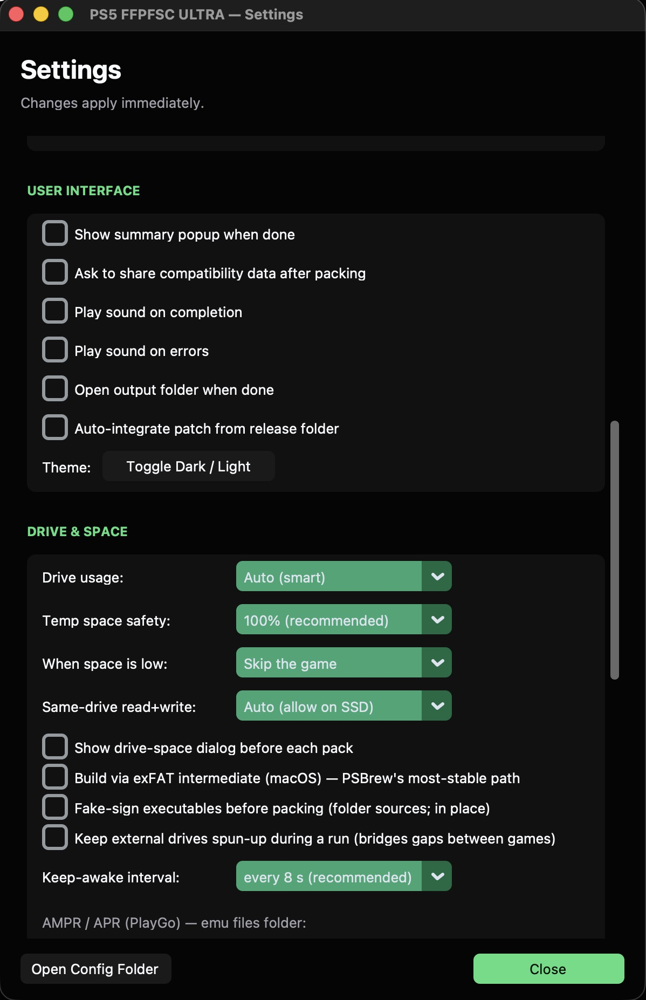
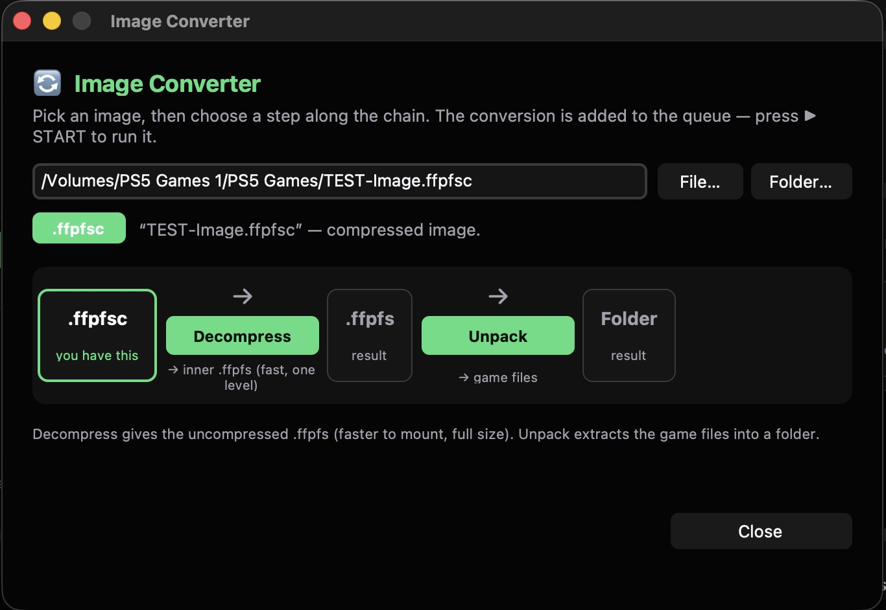
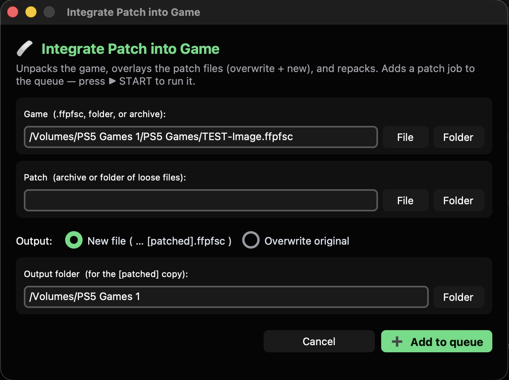

# PS5 FFPFSC ULTRA

<p align="center">
  
</p>

<p align="center">
  <b>Pack PS5 game dumps, disk images, and scene archives into mountable <code>.ffpfsc</code> containers, then open one back up to pull a single file out.</b>
</p>

<p align="center">
  
  
  
  
</p>

---

A desktop app that turns a PS5 game dump into a `.ffpfsc` container for ShadowMountPlus and MicroMount, and unpacks one back into a folder. Give it a game folder, a disk image (`.exfat` / `.ffpkg`), an existing `.ffpfs`, or a scene archive (ZIP / RAR / 7z, multi-part and password-protected included). It hands you a compressed `.ffpfsc` you can mount on a jailbroken console.

Built by Knutwurst on the Bizkut `ps5-ffpfs-cli` backend with PSBrew MkPFS. macOS is the primary, tested platform; it also runs on Windows and Linux from source.

## Screenshots

<table>
  <tr>
    <td align="center" width="50%"><br><sub><b>Browse &amp; extract</b> &nbsp;·&nbsp; peek inside a .ffpfsc and pull out one file, no full unpack</sub></td>
    <td align="center" width="50%"><br><sub><b>Settings</b> &nbsp;·&nbsp; smart drive routing, per-job format, fake-sign, and more</sub></td>
  </tr>
  <tr>
    <td align="center" width="50%"><br><sub><b>Convert</b> &nbsp;·&nbsp; decompress or unpack an image, step by step</sub></td>
    <td align="center" width="50%"><br><sub><b>Patch</b> &nbsp;·&nbsp; overlay an update onto a game and repack</sub></td>
  </tr>
</table>

## Why this one

A plain packer asks you to prepare a clean folder, then writes a single image to one drive and hopes it fits. This one does the thinking for you.

- **It routes the build across your drives.** The router reads the source off one drive, builds the inner image on your fast temp SSD, and streams the final container to the output drive, so no disk does a same-spindle read-and-write during compression. When the whole footprint fits the SSD it keeps everything there; when it doesn't, it splits the work; when the SSD can't even hold the image, it falls back to the output drive so the build still finishes. Every choice is printed in the log.
- **It knows your drives apart, even the awkward ones.** It detects SSD versus HDD per volume and refuses to treat a big slow disk as scratch just because it has the most free space. A USB SSD that reports no flash flag (common over a bridge) gets a quick timed write so it is recognized as the SSD it is. A free-space gate skips a job with real numbers instead of dying mid-build.
- **It builds images the console actually reads.** Packing forces the 64 KiB PFS block size the PS5 expects. A smaller block passes a local build and verify, then the console misreads the filesystem and crashes on launch. Boot-tested on firmware 11.60: 64 KiB boots, a 4 KiB build of the same game crashes.
- **You feed it the download, not a prepared folder.** It reads ZIP, RAR, and 7z straight through, including multi-part RAR sets and archives with encrypted headers. When a header is locked, it asks for the password once and remembers it. macOS carries a self-contained native UnRAR module, so nothing external is required for RAR.
- **It cleans the dump without throwing your files away.** Scene cruft like a `_DUPLEX_` group folder, loose `.nfo`, and `.sfv` never enters the image, yet none of it is deleted: the app moves it next to the finished `.ffpfsc` so the unlocker and the nfo stay with you. OS junk (`.DS_Store`, `._*`, `__MACOSX`) is dropped outright.
- **It runs a real queue, not a one-shot.** Mix pack, convert, patch, and fake-sign jobs, each with its own source, output folder, and format. Double-click a row to edit it. A failed job stays in the queue and the batch keeps going.
- **It opens a packed image and pulls one file out.** The Browse view lists what is inside a `.ffpfs` or `.ffpfsc` and extracts a single file or a whole folder without unpacking the rest. It decompresses only the blocks it touches, so opening a 100 GB container does not wait on a full decompression and pulling one file out costs a fraction of a full unpack.

## What it packs

- A decrypted PS5 game folder (`eboot.bin` plus `sce_sys/param.json`).
- A disk image: `.exfat` or `.ffpkg`.
- An existing `.ffpfs`, re-wrapped into its compressed `.ffpfsc`.
- An archive: ZIP, RAR, or 7z. It extracts the archive, finds the game inside, and packs that. Multi-part RAR sets collapse to one job. A 7z extracts through the native `7z` / `7zz` CLI when present (3-10x faster), and falls back to pure-Python `py7zr` otherwise.

Saved archive passwords are tried automatically, so a recurring scene password is never retyped. When no saved password unlocks an archive's header, the app asks once at add time and remembers the answer, which also lets the router size the job correctly up front.

## What it produces

- `.ffpfsc`, the compressed container, or `.ffpfs`, the uncompressed image (faster to mount, full size). The format is a per-job switch.
- A filename built from the game's real title in `param.json`: `Game Name [PPSA12345] [01.004].ffpfsc`. Names that would break ShadowMountPlus's length limit are shortened on a byte budget, dropping edition fluff ("Remastered", "Complete Edition") before truncating.
- For a release folder, the folder layout is recreated at the destination with the DLCs and extras sitting next to the finished container.

## The job queue

Add work through four buttons and run it in one pass:

- **Pack** a folder, image, `.ffpfs`, or archive into a `.ffpfsc` / `.ffpfs`.
- **Convert** an existing image: decompress a `.ffpfsc` to its inner `.ffpfs`, or unpack either to a folder.
- **Patch** a game by overlaying a patch (folder or archive) and repacking, into a new copy or over the original.
- **Sign** a folder's executables (fake-sign) so they boot on a jailbroken console.

Each job carries its own source, output folder, and format. Double-click a queued row to edit it. A failed or cancelled job stays in the queue marked as such, so the rest of the batch keeps running and a later Start retries it. The status panel shows the active phase, per-file detail, speed, ETA, compression ratio, temp usage, and CPU/RAM, with a live log alongside.

## Browse inside an image

The 🔎 Browse button opens a `.ffpfs` or `.ffpfsc` and shows its contents as a tree, with multi-select and a live name filter. Pick a file, a folder, or several at once, and extract just those to a folder you choose. The rest of the image stays packed.

It reads only the blocks it touches: listing the tree decompresses just the filesystem metadata, and extracting a file decompresses only that file's blocks. Neither costs a full unpack, even on a compressed `.ffpfsc` (which it reads by descending into the inner image and decoding blocks on demand). What comes out is byte-for-byte identical to the original, audited and sha256-verified against mkpfs's own extractor in both formats. The view is read-only and never changes the image.

## How it places work across drives

In Auto mode the router decides where each part of a build lives, then states its decision in the log:

- Source, inner image, and spool on one SSD when the whole footprint fits.
- Otherwise a split: the inner image on the SSD, the extracted source on the output drive, with the pass-2 spool routed wherever it fits.
- The output drive alone when nothing fits the SSD, so the build still completes.

It detects SSD versus HDD per drive, including USB SSDs that report no flash flag (it times a short write to tell them apart). A configurable temp folder and an optional extra scratch pool feed the router, and a free-space gate skips a job with real numbers rather than failing mid-build. You can force same-drive read-and-write on (for an SSD) or off in Settings.

## What it keeps out of the image, and what it keeps for you

- OS metadata never enters the image: `.DS_Store`, AppleDouble `._*` sidecars, `__MACOSX`, `Thumbs.db`. The app deletes them before packing.
- Scene-release extras never enter the image either, but the app preserves them. A `_DUPLEX_`-style group folder and loose `.nfo` / `.sfv` / `.diz` / `.par2` files move out of the dump and land next to the `.ffpfsc`, so the unlocker, the nfo, and the group's tools stay with you.

## Special titles

- **PlayGo / APR titles**: the app detects `playgo-chunk.dat`, injects the fakelib `.sprx` and an `AMPRIDX3` index, and signs before indexing so the index records the right sizes.
- **Fake-sign**: a vendored, pure-Python `make_fself` (no keys, no native dependency) re-signs `eboot.bin`, `.elf`, `.prx`, and `.sprx` in place. Already-signed files are skipped, so a repeat run is safe.

## Requirements

- Python 3.10 or newer, to run from source or to build.
- A C++ compiler for the bundled UnRAR module, needed only when building: Xcode Command Line Tools on macOS, `build-essential` on Linux, MSVC on Windows.
- Optional but recommended for fast 7z: a native 7-Zip CLI on `PATH` (`brew install sevenzip`, or `p7zip`). Without it, `.7z` extraction falls back to the slower pure-Python path.

## Run from source

Windows: double-click `RUN.bat`.

macOS and Linux:

```bash
python3 -m pip install customtkinter pillow tkinterdnd2 py7zr rarfile psutil cryptography
python3 -m pip install ./backend/unrar
python3 PS5_FFPFSC_ULTRA_v1.0.py
```

## Build a standalone app

macOS, produces `dist/PS5 FFPFSC ULTRA.app`:

```bash
./BUILD_MACOS_APP.sh
```

Windows, produces `dist\PS5_FFPFSC_ULTRA.exe`:

```bat
BUILD_EXE.bat
```

The macOS app is ad-hoc signed. On a Mac other than the one it was built on, clear the quarantine flag before the first launch:

```bash
xattr -dr com.apple.quarantine "PS5 FFPFSC ULTRA.app"
```

## Sources and credits

This is not a fork. It bundles and builds on the work below, with thanks to the authors:

- [ps5-ffpfs-cli](https://github.com/bizkut/ps5-ffpfs-cli) by Bizkut, the CLI and backend this GUI drives (MIT).
- [MkPFS](https://github.com/PSBrew/MkPFS) by PSBrew, the PFS image builder used for packing and compression (bundled, 0.0.8).
- `make_fself` from the ps5-payload-dev / flatz lineage, vendored for fake-signing (BSD-3).
- UnRAR by RARLAB ([rarlab.com](https://www.rarlab.com/)), vendored as C++ source for the built-in RAR module under the UnRAR license (free for extraction; it may not be used to build a RAR-compatible compressor).
- ShadowMountPlus and MicroMount, the loaders the `.ffpfsc` containers target.

Python libraries used: customtkinter, py7zr, rarfile, tkinterdnd2, Pillow, psutil, cryptography.

## License

The GUI and app code are MIT. The vendored UnRAR source keeps RARLAB's UnRAR license. MkPFS and `make_fself` keep their own licenses. See the upstream projects for their terms.
