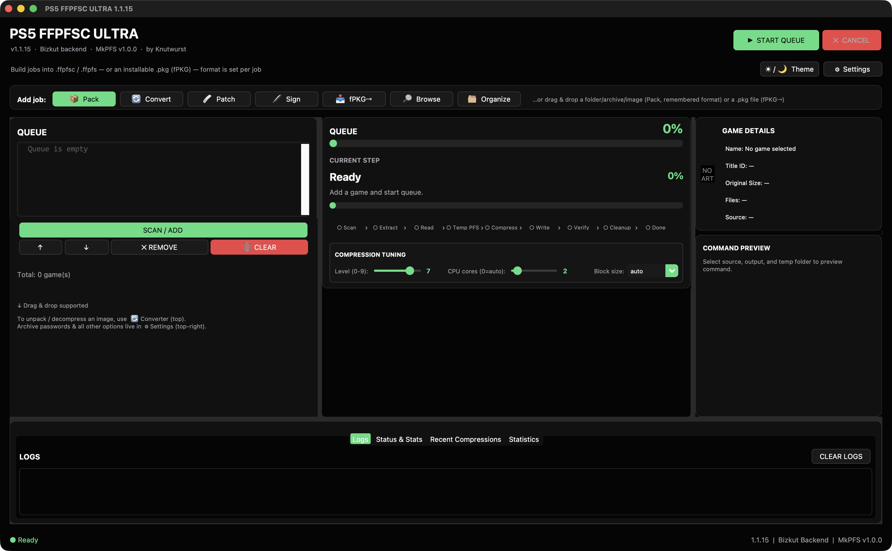
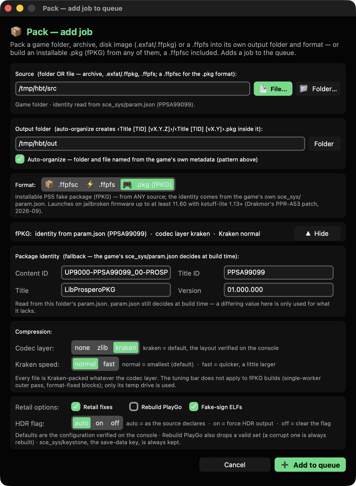
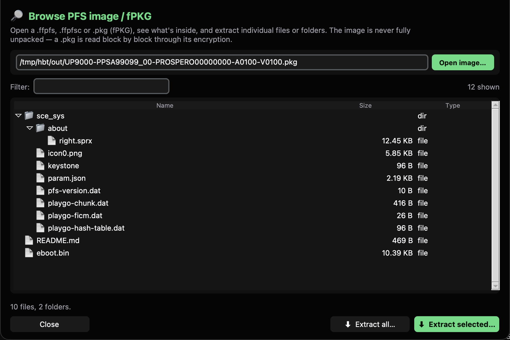
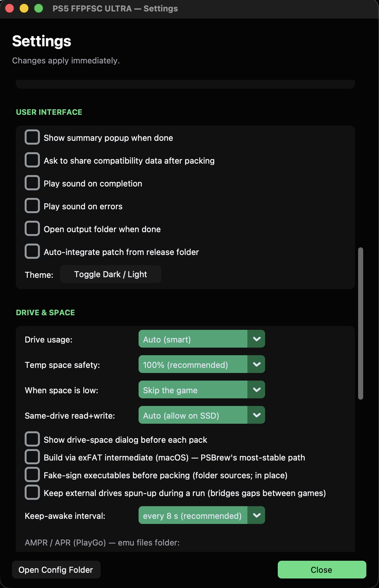
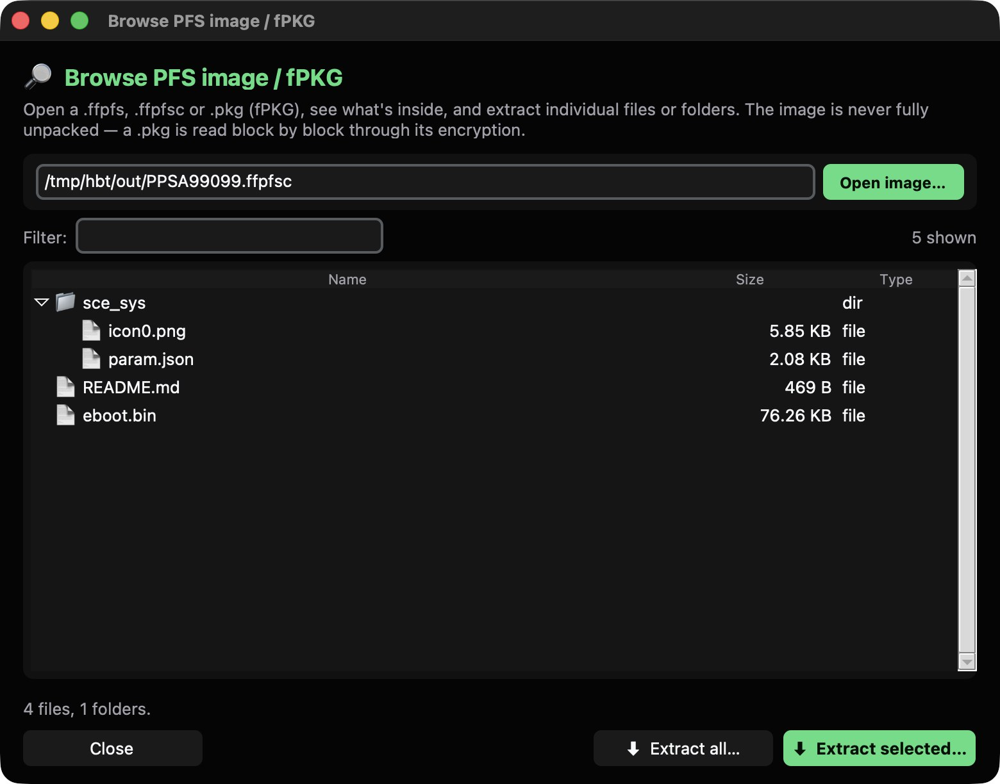
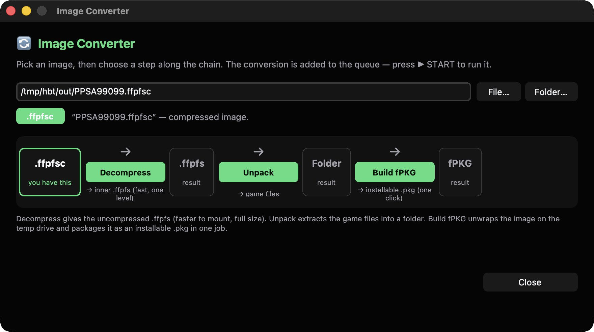
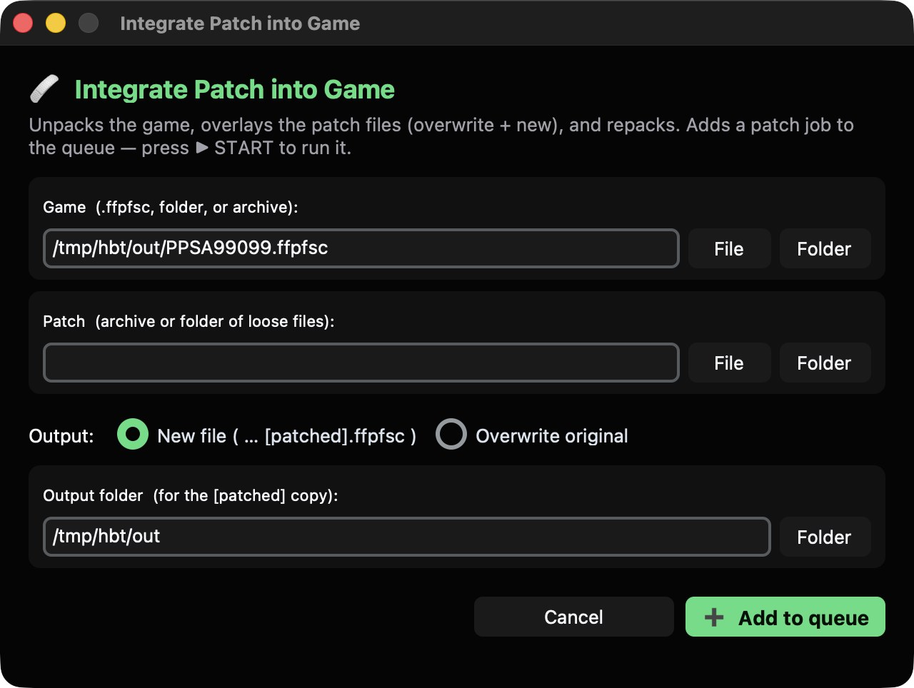

# PS5 FFPFSC ULTRA

<p align="center">
  
</p>

<p align="center">
  <b>Build PS5 <code>.ffpfsc</code> containers <i>and</i> installable <code>.pkg</code> fake packages on macOS.</b><br>
  Pack a game dump, a third-party archive, a disk image, or an existing container. Peek inside one and pull a single file out. All in one desktop app.
</p>

<p align="center">
  
  
  
  
  
  
</p>

---

## 🎮 New in 1.1.10 — PS5 fPKG that actually launches on 11.60

**Build console-installable PS5 `.pkg` files on macOS, in-process, no Wine, no Sony DLL.** The bundled `ffpfsc-pkg-tool` (a self-contained .NET 9 build of drakmor's LibProsperoPkg 1.2.0, GPL-3) turns any pack source — a decrypted game folder, a third-party archive, a `.ffpfsc`, an `.exfat` image — into a debug `.pkg` that installs and launches on a jailbroken PS5.

<p align="center">
  
</p>

**Verified 2026-09-24 on retail PS5, firmware 11.60, kstuff-lite 1.13-dr-test3:** the `HomebrewTest` fPKG produced by this tool launches — no `CE-100096-6`, no `beschädigte Daten` sequence, just the app coming up. Byte-diff against a `libScePubTools.dll` reference build: the inner PFS is byte-identical, only the outer PFS wrap differs in non-load-critical timestamp/ICV bytes. The old "≤ 11.40 only" firmware ceiling that shipped in every earlier build was a single wrong outer-PFS wrap mode in our builder — not a Sony patch, not something Wine could have fixed.

- **Any source** → `.pkg`: game folder, parent folder (scanned), third-party archive, disk image (`.exfat` / `.ffpkg`), an existing `.ffpfs` or `.ffpfsc` (unwrapped on the temp drive first).
- **Identity from the game itself.** Content id, title id, version, title read from the source's own `sce_sys/param.json` at build time. The dialog's identity fields are fallbacks for game folders that lack a `param.json`.
- **17-point validate checklist** runs after every build. If the console rejects the package the log tells you which invariant failed.
- **Auto-organize** names the result `<Title> [TITLEID] [vXX.YYY].pkg` in a per-title folder, straight from `param.json`.
- **fPKG⇢** goes the other direction: extract a finalized `.pkg` into a `/app0`-style folder (inner PFS + all `sce_sys` CNT metadata merged), ready to pack, patch, or turn back into a `.pkg`.
- **Browse** a `.pkg` without extracting the rest: the tree, plus surgical extract of a single file or folder. Decodes only the blocks it touches.

The firmware ceiling on any given day is the console-side jailbreak stack, not this builder. As newer `kstuff` variants land for 11.7x / 12.xx, packages built here are expected to launch there too — the format hasn't changed, only how far the jailbreak reaches.

---

## What it does, top to bottom

A desktop app that turns a PS5 game dump into a `.ffpfsc` container for ShadowMountPlus and MicroMount, or a debug `.pkg` for direct install on a jailbroken PS5. Give it a game folder, a disk image (`.exfat` / `.ffpkg`), an existing `.ffpfs` / `.ffpfsc`, a third-party archive (ZIP / RAR / 7z, multi-part and password-protected included), or a finalized `.pkg`. It picks the right pipeline, routes the build across your drives, and hands you a mountable container or an installable package.

Built by Knutwurst on a backend that grew out of Bizkut's `ps5-ffpfs-cli`, with PSBrew MkPFS. Builds and releases are macOS (Apple Silicon) only. The Python sources are portable in principle, but nothing other than macOS is tested.

## Screenshots

<table>
  <tr>
    <td align="center" width="50%"><br><sub><b>🔎 Browse a .pkg</b> &nbsp;·&nbsp; the whole tree of a fake-package — inner PFS + CNT metadata (param.json, icon, PlayGo, keystone) — decoded block by block, no full unpack</sub></td>
    <td align="center" width="50%"><br><sub><b>⚙️ Settings</b> &nbsp;·&nbsp; smart drive routing, per-job format, fake-sign, and more</sub></td>
  </tr>
  <tr>
    <td align="center" width="50%"><br><sub><b>🔎 Browse a .ffpfsc</b> &nbsp;·&nbsp; same tree view for a compressed PFS image — pick one file out without unpacking the rest</sub></td>
    <td align="center" width="50%"><br><sub><b>🔄 Convert</b> &nbsp;·&nbsp; decompress or unpack an image, step by step</sub></td>
  </tr>
  <tr>
    <td align="center" width="50%"><br><sub><b>🩹 Patch</b> &nbsp;·&nbsp; overlay an update onto a game and repack</sub></td>
    <td align="center" width="50%">&nbsp;</td>
  </tr>
</table>

## What it packs

- A decrypted PS5 game folder (`eboot.bin` plus `sce_sys/param.json`).
- A disk image: `.exfat` or `.ffpkg`.
- An existing `.ffpfs`, re-wrapped into its compressed `.ffpfsc`.
- An archive: ZIP, RAR, or 7z. It extracts the archive, finds the game inside, and packs that. Multi-part RAR sets collapse to one job. A 7z extracts through the native `7z` / `7zz` CLI when present (3-10x faster), and falls back to pure-Python `py7zr` otherwise.
- A finalized PS5 fake package (`.pkg`) — drop it in, or use the **📥 fPKG⇢** job, and the app pulls the whole `/app0` tree out (inner PFS + `sce_sys/param.json`, `icon0.png`, PlayGo files from the CNT container) into a folder you can then pack, patch, or turn back into a `.pkg` with the Pack job's `.pkg` format.

Saved archive passwords are tried automatically, so a recurring saved archive password is never retyped. When no saved password unlocks an archive's header, the app asks once at add time and remembers the answer, which also lets the router size the job correctly up front.

## What it produces

- **`.ffpfsc`** — the compressed container, or **`.ffpfs`** the uncompressed image (faster to mount, full size). Per-job switch.
- **`.pkg`** — an installable PS5 debug fake package. Pick it as the **Format** in the Pack job — any source works. The identity is read from the game's own `sce_sys/param.json` when the job runs; identity fields in the dialog are fallbacks for game folders without a `param.json`. The tool auto-generates `sce_sys/icon0.dds` via Magick.NET (the console needs it to launch). See [What's new](#-new-in-1110--ps5-fpkg-that-actually-launches-on-1160) for the firmware story.
- **Auto-organize** (Pack dialog, default on) names the result from the game's own `param.json`, whatever the source was called: `<Output>/<Title> [TITLEID] [vXX.YYY.ZZZ]/<Title> [TITLEID] [vXX.YYY].ffpfsc` (or `.pkg`), bundle extras copied into that folder — throw in a folder named `convert` with a third-party archive inside and you still get `Example Quest Deluxe Edition [PPSA00001] [v01.200.007]/Example Quest Deluxe Edition [PPSA00001] [v01.200].ffpfsc`. Names that would break ShadowMountPlus's byte limit are shortened on a byte budget, dropping edition fluff ("Remastered", "Complete Edition") before truncating. For a release folder, the folder layout is recreated at the destination with the DLCs and extras sitting next to the finished container.

## Why this one

A plain packer asks you to prepare a clean folder, then writes a single image to one drive and hopes it fits. This one does the thinking for you.

- **It routes the build across your drives.** The router reads the source off one drive, builds the inner image on your fast temp SSD, and streams the final container to the output drive, so no disk does a same-spindle read-and-write during compression. When the whole footprint fits the SSD it keeps everything there; when it doesn't, it splits the work; when the SSD can't even hold the image, it falls back to the output drive so the build still finishes. Every choice is printed in the log.
- **It knows your drives apart, even the awkward ones.** It detects SSD versus HDD per volume and refuses to treat a big slow disk as scratch just because it has the most free space. A USB SSD that reports no flash flag (common over a bridge) gets a quick timed write so it is recognized as the SSD it is. A free-space gate skips a job with real numbers instead of dying mid-build.
- **It builds images the console actually reads.** Packing forces the 64 KiB PFS block size the PS5 expects. A smaller block passes a local build and verify, then the console misreads the filesystem and crashes on launch. Boot-tested on firmware 11.60: 64 KiB boots, a 4 KiB build of the same game crashes.
- **You feed it the download, not a prepared folder.** It reads ZIP, RAR, and 7z straight through, including multi-part RAR sets and archives with encrypted headers. When a header is locked, it asks for the password once and remembers it. macOS carries a self-contained native UnRAR module, so nothing external is required for RAR.
- **It cleans the dump without throwing your files away.** Tooling junk like a `_bundle_` group folder, loose `.nfo`, and `.sfv` never enters the image, yet none of it is deleted: the app moves it next to the finished `.ffpfsc` so the nfo and the extras stay with you. OS junk (`.DS_Store`, `._*`, `__MACOSX`) is dropped outright.
- **It runs a real queue, not a one-shot.** Mix pack, convert, patch, fake-sign, fPKG extract, and fPKG build jobs, each with its own source, output folder, and format. Double-click a row to edit it. A failed job stays in the queue and the batch keeps going.
- **It opens a packed image and pulls one file out.** The Browse view lists what is inside a `.ffpfs`, a `.ffpfsc`, or a `.pkg` (fPKG) and extracts a single file or a whole folder without unpacking the rest. It decompresses only the blocks it touches, so opening a 100 GB container does not wait on a full decompression and pulling one file out costs a fraction of a full unpack.

## The job queue

Add work through seven buttons and run it in one pass:

- **📦 Pack** a folder, image, `.ffpfs`, or archive into a `.ffpfsc` / `.ffpfs` — **or into a `.pkg`** by picking `.pkg` as the Format.
- **🔄 Convert** an existing image: decompress a `.ffpfsc` to its inner `.ffpfs`, or unpack either to a folder.
- **🩹 Patch** a game by overlaying a patch (folder or archive) and repacking, into a new copy or over the original.
- **🖊 Sign** a folder's executables (fake-sign) so they boot on a jailbroken console.
- **📥 fPKG⇢** extract a finalized PS5 `.pkg` into a `/app0`-style folder (inner PFS + CNT metadata merged).
- **🔎 Browse** peek inside a `.ffpfs` / `.ffpfsc` / `.pkg` and pull out a single file or folder.
- **🗂 Organize** batch-rename a folder tree of existing containers into the auto-organize layout.

Each job carries its own source, output folder, and format. Double-click a queued row to edit it. A failed or cancelled job stays in the queue marked as such, so the rest of the batch keeps running and a later Start retries it. The status panel shows the active phase, per-file detail, speed, ETA, compression ratio, temp usage, and CPU/RAM, with a live log alongside.

## Browse inside an image

The 🔎 Browse button opens a `.ffpfs`, a `.ffpfsc`, or a `.pkg` (fPKG) and shows its contents as a tree, with multi-select and a live name filter. Pick a file, a folder, or several at once, and extract just those to a folder you choose. The rest of the image stays packed — a `.pkg` is decrypted and decoded block by block (a 240 MB package lists in about a tenth of a second reading 1.5 MiB), and the `sce_sys` metadata the package keeps outside its inner image (`param.json`, icons, PlayGo files) shows up in the tree like any other file.

It reads only the blocks it touches: listing the tree decompresses just the filesystem metadata, and extracting a file decompresses only that file's blocks. Neither costs a full unpack, even on a compressed `.ffpfsc` (which it reads by descending into the inner image and decoding blocks on demand). What comes out is byte-for-byte identical to the original, audited and sha256-verified against mkpfs's own extractor in both formats. The view is read-only and never changes the image.

## How it places work across drives

In Auto mode the router decides where each part of a build lives, then states its decision in the log:

- Source, inner image, and spool on one SSD when the whole footprint fits.
- Otherwise a split: the inner image on the SSD, the extracted source on the output drive, with the pass-2 spool routed wherever it fits.
- The output drive alone when nothing fits the SSD, so the build still completes.

It detects SSD versus HDD per drive, including USB SSDs that report no flash flag (it times a short write to tell them apart). A configurable temp folder and an optional extra scratch pool feed the router, and a free-space gate skips a job with real numbers rather than failing mid-build. You can force same-drive read-and-write on (for an SSD) or off in Settings.

## What it keeps out of the image, and what it keeps for you

- OS metadata never enters the image: `.DS_Store`, AppleDouble `._*` sidecars, `__MACOSX`, `Thumbs.db`. The app deletes them before packing.
- Third-party extras never enter the image either, but the app preserves them. A `_bundle_`-style group folder and loose `.nfo` / `.sfv` / `.diz` / `.par2` files move out of the dump and land next to the `.ffpfsc`, so the nfo and the group's tools stay with you.

## Special titles

- **PlayGo / APR titles**: the app detects `playgo-chunk.dat`, injects the fakelib `.sprx` and an `AMPRIDX3` index, and signs before indexing so the index records the right sizes.
- **Fake-sign**: a vendored, pure-Python `make_fself` (no keys, no native dependency) re-signs `eboot.bin`, `.elf`, `.prx`, and `.sprx` in place. Already-signed files are skipped, so a repeat run is safe.

## Requirements

- macOS on Apple Silicon. Builds and releases exist for nothing else; the Python sources are portable in principle but untested on other systems.
- Python 3.10 or newer, to run from source or to build.
- A C++ compiler for the bundled UnRAR module (Xcode Command Line Tools), needed only when building.
- Optional but recommended for fast 7z: a native 7-Zip CLI on `PATH` (`brew install sevenzip`, or `p7zip`). Without it, `.7z` extraction falls back to the slower pure-Python path.

## Run from source

```bash
python3 -m pip install customtkinter pillow tkinterdnd2 py7zr rarfile psutil cryptography
python3 -m pip install ./backend/unrar
python3 PS5_FFPFSC_ULTRA_v1.0.py
```

## Build a standalone app

Run the build script from the repository root inside an activated virtual environment (it refuses to run outside one and installs the pinned inputs from `requirements-build.txt`). It produces `dist/PS5 FFPFSC ULTRA.app`, the release archive `dist/PS5-FFPFSC-ULTRA-<version>-macos-arm64.zip` and its `.sha256`:

```bash
python3 -m venv .venv && source .venv/bin/activate
./BUILD_MACOS_APP.sh
```

The app is ad-hoc signed. On a Mac other than the one it was built on, clear the quarantine flag before the first launch:

```bash
xattr -dr com.apple.quarantine "PS5 FFPFSC ULTRA.app"
```

## Sources and credits

This is not a fork. It bundles and builds on the work below, with thanks to the authors:

- [ps5-ffpfs-cli](https://github.com/bizkut/ps5-ffpfs-cli) by Bizkut, the backend wrapper that `backend/cli.py` grew out of (no license file upstream; see `NOTICES.md`).
- [MkPFS](https://github.com/PSBrew/MkPFS) by PSBrew, the PFS image builder used for packing and compression (bundled, 1.0.0).
- [LibProsperoPkg](https://github.com/drakmor/LibProsperoPkg) 1.2.0 by drakmor, the PS5 `.pkg` build/extract library the bundled `ffpfsc-pkg-tool` wraps (GPL-3, sourced from the a53-fpkg 0.5 release). Wrapper source under `backend/native/src/ffpfsc-pkg-tool/`.
- `make_fself` from the ps5-payload-dev / flatz lineage, vendored for fake-signing (BSD-3).
- UnRAR by RARLAB ([rarlab.com](https://www.rarlab.com/)), vendored as C++ source for the built-in RAR module under the UnRAR license (free for extraction; it may not be used to build a RAR-compatible compressor).
- ShadowMountPlus and MicroMount, the loaders the `.ffpfsc` containers target.
- kstuff-lite by EchoStretch and the fpkg-launch fixes by Drakmor + ArkSama (2026-09), the console-side pieces without which fPKG on 11.60 wouldn't launch at all.

Python libraries used: customtkinter, py7zr, rarfile, tkinterdnd2, Pillow, psutil, cryptography.

## License

Full breakdown — including trademark and user-responsibility notes — is in [`NOTICES.md`](NOTICES.md). In short:

- **Source code authored here** (the Python GUI, the Python wrappers around the bundled tools, the C# wrapper around LibProsperoPkg, the tests and build inputs; for `backend/cli.py` this project's own contributions, see below) — **MIT** (see [`LICENSE`](LICENSE)).
- **Bundled MkPFS 1.0.0** by PSBrew — **GPL-3.0-or-later** ([`backend/mkpfs/LICENSE`](backend/mkpfs/LICENSE)).
- **Bundled LibProsperoPkg 1.2.0** by SvenGDK/drakmor — **GPL-3.0-or-later** ([`backend/native/LICENSE.LibProsperoPkg`](backend/native/LICENSE.LibProsperoPkg)).
- **Bundled UnRAR sources** by RARLAB — **UnRAR license**; free for extraction, but **may not** be used to build a RAR-compatible compressor ([`backend/unrar/license.txt`](backend/unrar/license.txt)).
- **Vendored `make_fself.py`** (Alex Free / flatz / ps5-payload-dev lineage) — **BSD-3-Clause**; attribution in the file header.
- **Bizkut's `ps5-ffpfs-cli`** — no license file upstream. `backend/cli.py` started as that tool's backend wrapper and has been rewritten extensively here; `backend/unrar/rarfile.py` mirrors a subset of the `rarfile` API it used. No license is claimed for what remains of the upstream code; MIT applies to this project's own contributions. Detail in `NOTICES.md`.

**The compiled `.app` binary** statically embeds MkPFS and LibProsperoPkg and is therefore distributed as a **combined work under GPL-3.0-or-later** (GPL-3 section 5). Everything needed to rebuild it is in this repository — the Python and C# sources, the pinned NuGet references, and the LibProsperoPkg 1.2.0 assembly (pristine and patched, with the patch tooling and a modification notice under `backend/native/src/ffpfsc-pkg-tool/lib/`); LibProsperoPkg's own source is upstream at [drakmor/LibProsperoPkg](https://github.com/drakmor/LibProsperoPkg). Every bundled component's license is GPL-3 compatible.

**Not affiliated with Sony Interactive Entertainment Inc.** "PlayStation" and "PS5" are trademarks of Sony Interactive Entertainment; use here is nominative fair use to identify the format and console this tool interoperates with. This tool builds and processes PS5 package formats from files **you** supply — it does not decrypt, decode, or distribute any Sony-owned content, firmware, keys, or executables. You are responsible for having the legal right to any content you process with it (dumps of games you own, homebrew you have written or been licensed to redistribute). See `NOTICES.md` for the full statement.
